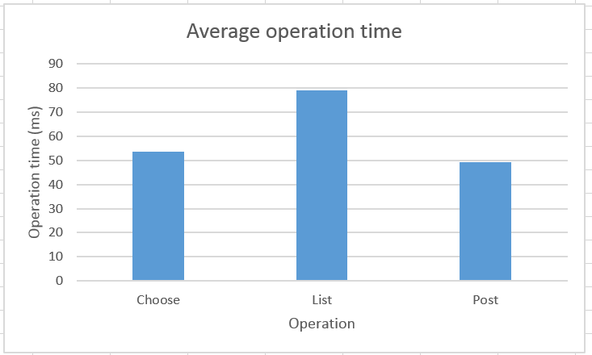
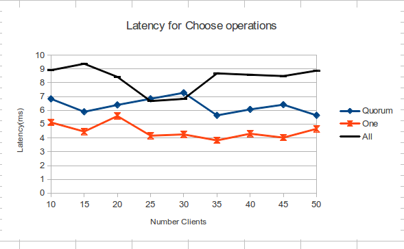
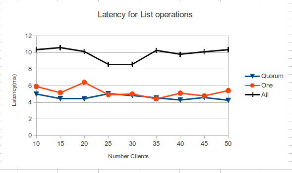
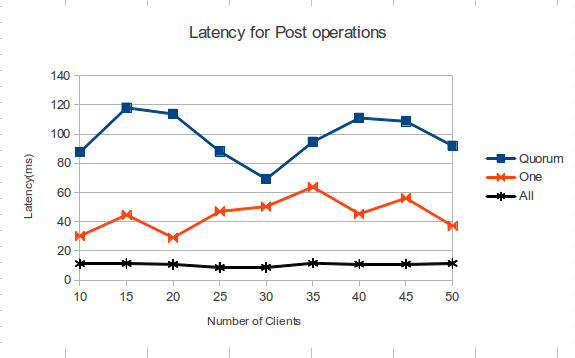

# CSCI 565 Project 2: Distributed Bulletin Board

Authors: Chris Card, Steven Ruppert

This project is a implementation of a simple distributed Bulletin
Board (key-value store) with a Cassandra-like
client-specified consistency model. See the [design](#Design)
section for more details.

## Files:

- Server/:
 - *Server.java*: starts the specific types of servers either master or slave
    and binds them to a port.
 - *MasterServer.java*: The master/coordinator node implementation. Controls the read/write
   quorums to ensure the eventual consistency of the system.
 - *SlaveServer.java*: Slave node implementation. Forwards operations to the master, and
   replicates writes and reads.
 - *Slave.java*: Interface definition for slave nodes, i.e. local read/write operations.
 - *Master.java*: Master/coordinator-specific tasks e.g. slave node registration.
 - *Node.java*: `ArticleStore`-backed implementation of BulletinBoard. Both MasterServer and
    SlaveServer share this superclass.
- Client/:
 - *Client.java*: CLI client.
- lib/: third-party libraries used in the project.
 - *guava-15.0.jar*: Various nice java library functions.
 - *jdbi-2.5.1.jar*: JDBC database access control made easier.
 - *log4j-api-2.0-beta9.jar, log4j-core-2.0-beta9.jar*: Log4j2 logging framework.
 - *jcommander-1.32.jar*: args parsing without ripping your hair out.
- Domain/:
 - *Article.java*: Main domain class, i.e. has an id and some text content.
 - *BulletinBoard.java*: Client-facing interface for server nodes, i.e. POST, LIST, and GET
   operations.
- Shared/:
 - *ArticleStore.java*: JDBI-based persistent article database DAO.
- *runServer.sh*: Starts a server either a master or slave
- *client.sh*: Convenience script to run CLI client defined in `Client.java` with the
  correct java RMI options.
- *startServers.sh*: starts servers on multiple machines specified by `hosts.txt`.
- *hosts.txt*: defines the machines, ports, and types of servers to start on each machine
   as `type::hostname::port` e.g. `[master | slave]::bb136-19.mines.edu::5555`.
- *testClientMethods.java*: Test cases and test runner for cluster operation.

## Design

Bulletin board state is distributed among a cluster of individual server
processes which store local state in a persistent disk-backed RDBMS. A single
**master** server coordinates client operations throughout the cluster and
keeps track servers within the cluster. **Slave** servers replicate article
reads and writes from the master, and register themselves with the master
server upon startup. Slave nodes only communicate with the master server
directly. Thus, the system can scale by adding slave nodes registered with the
same master.

**Clients** connect to one of the servers (either master or slave) upon startup
and issue commands (LIST, POST, CHOOSE). Clients also optionally keep local
persistent copies of articles successfully committed to the cluster in order to
ensure read-your-writes consistency even with non-quorum writes and reads.

### Read/Write Replication

Client reads/writes are coordinated by the master server. If a client sends
operations to a slave server, the operations are passed through to the master
for execution. This centralized design simplifies coordination as well as
allowing the master to impose a global ordering
on article writes through monotonically increasing numeric ids.

When the master server receives a client operation (read/write), the operation
is broadcast to all nodes in the cluster, which perform the
operation locally and return the results to the master. Depending on the
consistency and performance needs of the client,
the master will wait for a certain subset of cluster nodes to return before
returning the aggregated result to the client.

The number of nodes for which the master will wait is specified by the client
as one of:

- **ALL**: the master will wait for *all* nodes in the cluster to respond.
- **QUORUM**: for write operations, the master will wait for `N / 2 + 1` nodes
  (of `N`), or `N / 2` for read operations.
- **ONE**: the master will return after the first node responds.

The semantics of these consistency modes are modeled after [Cassandra's
consistency modes][0]. With these semantics, the classical models of
consistency can thus be achieved by using the correct combination of read and
write modes:

- **Sequential Consistency** - Write **ALL** and read **ONE**.
- **Quorum Consistency** - Write **QUORUM** and read **QUORUM**.
- **Read-your-writes Consistency** - Write **ONE** and read **ONE**, with the
  client's local database enabled.

Note that operations are still broadcast to all nodes regardless of the client.
Thus, during normal operation,
all writes are replicated fully across the cluster and reads are performed on
all nodes (even though some results
will be ignored at non-ALL consistency modes). Transient node failures and
network partitions are repaired by
a periodic **sync** task that fully copies the master node's state to each
slave.

[0]: http://www.datastax.com/documentation/cassandra/2.0/webhelp/index.html#cassandra/dml/dml_config_consistency_c.html

### Failure Modes

No automatic fault-detection or recovery is performed by the system. On master
failure, the slave nodes will eventually stop. On
slave failure, the master node will continue to operate at reduced consistency
modes (QUORUM or ONE) as long as there are enough
nodes left.

Write failures indicate only that the required number of nodes did not respond
in a reasonable time interval (5 seconds)--the write
still could have happened on a number of nodes, and due to the append-only
nature of the bulletin-board, the failed article
could still potentially appear in future reads after the background **sync**
task runs. Clients who retry failed requests can
thus potentially create articles with duplicate content.

## Benchmarks

A load test with 4 server nodes and 10 clients performing operations
simultaneously resulted in the following latencies
at **QUORUM** writes and **QUORUM** reads:



A more thorough test was conducted to study the scaling characteristics of
various consistency modes. 3 servers running on 2 separate machines in the
alamode linux lab were load tested with a number of clients performing
simultaneous POST, CHOOSE, and LIST operations for 5 seconds at
a specified consistency mode. Server nodes used in-memory databases to
eliminate disk write latency as a factor.

The average latency per operation is graphed below:







Note that the POST latency for ALL consistency is significantly lower than
QUORUM or ONE consistency, which doesn't make intuitive sense. We believe this
is because we are reporting the *average* latency per operation, which is sensitive
to outliers. The non-ALL modes still broadcast writes to all nodes, so the writes
that are broadcast and not waited upon by the master server will "bunch up" causing
a much larger spread in latency values for ONE and QUORUM consistencies, bringing up the
average latency. A measure of median would probably more accurately gauge the performance
differences between the consistency modes.

## Running

### Build

    make

### Running the Servers

To run a single server:

    ./runServer.sh -s <socket> [-master | -slave -mhost <master hostname>:<master socket>]

To start a cluster of servers:

    ./startServers.sh [-start | -stop]

**Note**: this command reads the file called `hosts.txt` which has
lines in the following format:

    [master | slave]::<hostname>::<socket>

The first line MUST be the master server.

For example:

```
master::bb136-19.mines.edu::5555
slave::bb136-10.mines.edu::5555
slave::bb136-10.mines.edu::5556
```

## Client

To interact with the server:

    ./client.sh [options]

Run `client.sh` without options for documentation and example usage.

## Tests

### Build

    make

### Run Tests

Boots up a 3 node cluster and outputs the results of consistency tests:

    ./runTests.sh

`runTests.sh` additionally runs the load test for the syste. Run:

    ./getStats.rb <output csv filename>

to process the text logs produced during the load test to a `.csv` of operation
latencies.
